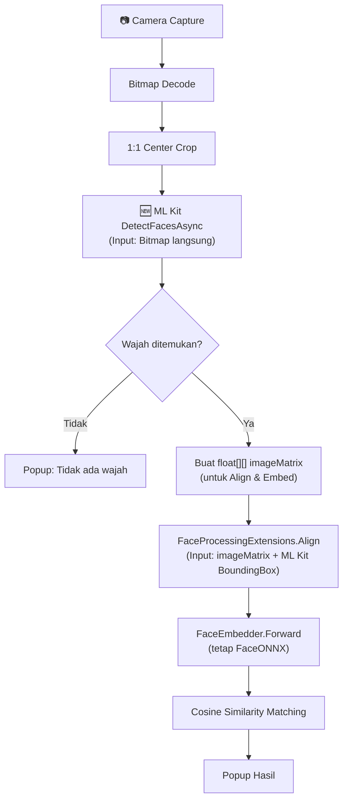

# Migrasi Face Detection: YuNet → Google ML Kit

## Latar Belakang

YuNet ONNX saat ini memakan waktu **~2085 ms** di device Android Anda untuk tahap deteksi saja. Ini karena:
1. Model dijalankan melalui `Microsoft.ML.OnnxRuntime` tanpa akselerasi hardware (XNNPACK/NNAPI)
2. Preprocessing manual (resize, BGR conversion) menambah overhead
3. Decoding output model (per-stride loop) juga tidak trivial

**Google ML Kit Face Detection** adalah alternatif yang sangat menjanjikan karena:
- Dioptimasi oleh Google secara native untuk chipset ARM Android (termasuk MediaTek/Unisoc)
- Menggunakan akselerator hardware (GPU/NNAPI) secara otomatis di belakang layar
- Tidak perlu preprocessing manual — cukup lempar `Android.Graphics.Bitmap`, ML Kit yang mengurus sisanya
- Benchmark tipikal: **20 - 80 ms** untuk deteksi wajah pada mode `PerformanceModeFast`

## Poin Penting yang Perlu Diketahui

> [!IMPORTANT]
> **ML Kit hanya untuk DETEKSI (lokasi wajah), bukan RECOGNITION (embedding)**. Pipeline embedding tetap menggunakan `FaceONNX.FaceEmbedder`. Kita perlu menjembatani hasil ML Kit (bounding box `Android.Gms.Vision.Faces.Face`) ke format `FaceONNX.FaceDetectionResult` agar `FaceProcessingExtensions.Align()` dan `FaceEmbedder.Forward()` tetap bisa dipakai.

> [!WARNING]
> **Google Play Services Required**: ML Kit versi "unbundled" membutuhkan Google Play Services di device. Jika device Anda memiliki Google Play Services (kebanyakan HP Android mainstream), ini akan bekerja. Jika tidak, kita harus pakai versi "bundled" yang menambah ~6MB ke APK size.

## Open Questions

1. **Bundled vs Unbundled model?**
   - **Unbundled** (`Xamarin.Google.MLKit.FaceDetection`): Model diunduh otomatis pertama kali via Google Play Services. APK lebih kecil, tapi butuh internet sekali.
   - **Bundled** (`Xamarin.GooglePlayServices.MLKit.FaceDetection`): Model langsung masuk ke APK. Lebih besar tapi 100% offline dari awal.
   - **Rekomendasi**: Mulai dengan **Unbundled** (lebih umum dipakai), karena project ini R&D dan device Anda pasti punya Google Play Services.

2. **Apakah device Anda punya Google Play Services?** (Jika pakai HP Huawei tanpa GMS, kita harus pakai versi bundled)

---

## Proposed Changes

### 1. NuGet Package

#### [MODIFY] [FaceRecognitionExample.csproj](file:///c:/Users/TUF/source/repos/FaceRecognitionExample/FaceRecognitionExample/FaceRecognitionExample.csproj)

Tambahkan package:
```xml
<PackageReference Include="Xamarin.Google.MLKit.FaceDetection" Version="16.1.7" />
```

---

### 2. ML Kit Face Detector Service

#### [NEW] [MLKitFaceDetectorService.cs](file:///c:/Users/TUF/source/repos/FaceRecognitionExample/FaceRecognitionExample/Services/MLKitFaceDetectorService.cs)

File baru khusus Android yang membungkus Google ML Kit Face Detection API:

```csharp
// Hanya untuk Android (menggunakan #if ANDROID)
// Namespace: FaceRecognitionExample.Services

public class MLKitFaceDetectorService
{
    private Com.Google.MLKit.Vision.Face.FaceDetector _detector;

    public MLKitFaceDetectorService()
    {
        var options = new Com.Google.MLKit.Vision.Face.FaceDetectorOptions.Builder()
            .SetPerformanceMode(Com.Google.MLKit.Vision.Face.FaceDetectorOptions.PerformanceModeFast)
            .SetLandmarkMode(Com.Google.MLKit.Vision.Face.FaceDetectorOptions.LandmarkModeAll)
            .SetMinFaceSize(0.15f)
            .Build();
        _detector = Com.Google.MLKit.Vision.Face.FaceDetection.GetClient(options);
    }

    // Input: Android.Graphics.Bitmap
    // Output: List<MLKitFaceResult> (custom DTO dengan BoundingBox + Landmarks)
    public async Task<List<MLKitFaceResult>> DetectFacesAsync(Android.Graphics.Bitmap bitmap)
    {
        // Menggunakan InputImage.FromBitmap()
        // Menunggu hasil secara async via TaskCompletionSource
        // Mengkonversi Face objects menjadi MLKitFaceResult
    }
}
```

**Kunci desain:**
- `SetPerformanceMode(PerformanceModeFast)` → prioritas kecepatan, bukan akurasi landmark
- `SetLandmarkMode(LandmarkModeAll)` → tetap ambil landmark (mata, hidung, mulut) untuk alignment yang lebih baik di masa depan
- Async via `TaskCompletionSource<T>` karena ML Kit Android API menggunakan callback pattern (Java `OnSuccessListener` / `OnFailureListener`)

---

### 3. Result DTO

#### [NEW] [MLKitFaceResult.cs](file:///c:/Users/TUF/source/repos/FaceRecognitionExample/FaceRecognitionExample/Models/MLKitFaceResult.cs)

```csharp
public class MLKitFaceResult
{
    public System.Drawing.Rectangle BoundingBox { get; set; }
    public float Score { get; set; }  // HeadEulerAngleY atau confidence
    // Landmarks opsional untuk alignment di masa depan
}
```

Menggunakan `System.Drawing.Rectangle` agar kompatibel langsung dengan `FaceProcessingExtensions.Align(imageMatrix, rectangle, angle, clamp)`.

---

### 4. Block Comment YuNet

#### [MODIFY] [YuNetFaceDetector.cs](file:///c:/Users/TUF/source/repos/FaceRecognitionExample/FaceRecognitionExample/Services/YuNetFaceDetector.cs)

**Seluruh isi file** akan di-wrap dengan block comment:
```csharp
/*
=== YUNET FACE DETECTOR (DISABLED - Replaced by Google ML Kit) ===
... seluruh kode yang sudah ada ...
=== END YUNET FACE DETECTOR ===
*/
```

File TIDAK dihapus, hanya di-disable.

---

### 5. Update Pipeline di MainPage

#### [MODIFY] [MainPage.xaml.cs](file:///c:/Users/TUF/source/repos/FaceRecognitionExample/FaceRecognitionExample/MainPage.xaml.cs)

Perubahan utama:

**a) Field declarations (baris ~16)**
```diff
- private YuNetFaceDetector _yuNetDetector;
+ // private YuNetFaceDetector _yuNetDetector; // DISABLED - YuNet
+ private MLKitFaceDetectorService _mlKitDetector; // NEW - ML Kit
```

**b) Model initialization (baris ~44-49)**
```diff
- using var stream = await FileSystem.OpenAppPackageFileAsync("face_detection_yunet.onnx");
- ... (semua loading YuNet) ...
- _yuNetDetector = new YuNetFaceDetector(modelBytes, 640, 640);
+ // YuNet loading DISABLED
+ _mlKitDetector = new MLKitFaceDetectorService(); // ML Kit tidak perlu load model manual
```

**c) Detection call (baris ~274-279)**

Perubahan paling signifikan: ML Kit menerima `Android.Graphics.Bitmap` langsung, jadi kita **TIDAK perlu** konversi ke `float[][,] imageMatrix` untuk tahap deteksi. 

Alur baru:
1. ML Kit deteksi wajah dari `Android.Graphics.Bitmap` → dapat bounding box
2. Bounding box digunakan untuk `FaceProcessingExtensions.Align(imageMatrix, box, ...)` → masih butuh `imageMatrix` untuk tahap Align & Embed
3. Jadi `imageMatrix` tetap dibuat, tapi **setelah** ML Kit selesai mendeteksi (bukan sebelumnya untuk input ke detector)

```csharp
// BEFORE (YuNet):
// faces = _yuNetDetector.Forward(imageMatrix);

// AFTER (ML Kit):
var mlkitResults = await _mlKitDetector.DetectFacesAsync(androidBitmap);
// Convert ke FaceDetectionResult[] via Reflection (sama seperti YuNet)
```

**d) Bounding Box Drawable (baris ~425-461)**

Drawable tetap menerima `FaceDetectionResult[]`, jadi **tidak perlu diubah** selama kita konversi hasil ML Kit ke format yang sama.

---

## Ringkasan Alur Pipeline Baru



**Optimasi kunci:** ML Kit menerima Bitmap langsung, jadi kita bisa **menunda** pembuatan `imageMatrix` (yang mahal) sampai ML Kit mengkonfirmasi ada wajah. Jika tidak ada wajah, kita skip pembuatan matrix sepenuhnya → hemat ~145 ms preprocessing.

---

## Verification Plan

### Build Test
```bash
dotnet build -c Debug -f net8.0-android
```

### Manual Verification (oleh Anda)
1. Deploy ke device Android
2. Pastikan ML Kit berhasil mendeteksi wajah (popup muncul dengan breakdown waktu)
3. Bandingkan angka **Face Detection** di popup:
   - YuNet sebelumnya: ~2085 ms  
   - ML Kit target: **< 100 ms**
4. Pastikan embedding & matching masih bekerja (popup "Berhasil" / "Duplikat" muncul dengan benar)
5. Cek total end-to-end time apakah sudah mendekati target < 1.5 detik
